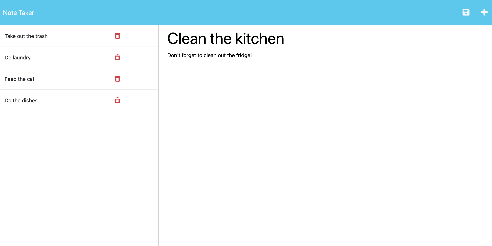

# Note Taker App

In this project, I began with the starter code for the front end, and added the back end code and connected the two. Finally, I deployed the entire application to Heroku.

The purpose of the app is to be able to write and save notes. This app uses an Express.js back end to save and retrieve note data from the db.json file.

I completed the following:

1. When the Note Taker opens, the user is presented with a landing page with a link to a notes page.
2. When the user clicks on the link to the notes page, they are presented with a page with existing notes listed in the left-hand column, plus empty fields to enter a new note title and the note’s text in the right-hand column.
3. When the user enters a new note title and the note's text, a Save icon appears in the navigation at the top of the page.
4. When the user clicks on the Save icon, the new note they have entered is saved and appears in the left-hand column with the other existing notes.
5. When the user clicks on an existing note in the list in the left-hand column, that note appears in the right-hand column.
6. When the user clicks on the plus icon in the top right of the page, they are presented with empty fields to enter a new note title and the note's text in the right-hand column.

## Screenshot

## Deployed Application

[https://frozen-falls-86360.herokuapp.com/](https://frozen-falls-86360.herokuapp.com/)
